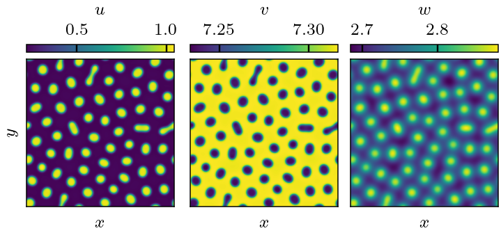

[](https://zenodo.org/doi/10.5281/zenodo.11397676)

# ReactGPU

## Overview

This package simulates reaction-diffusion systems of the form
$$\partial_t \vec\rho = \vec{R} + \mathbf{D} \nabla^2 \vec\rho\,$$
where $\vec{\rho} = (\rho^1, \dots, \rho^m)^\top \in \mathcal{C} \cong \mathbb{R}^m$ is an $m$-component chemical field, $\vec{R} \in \mathcal{C}$ is the chemical flux and $\mathbf{D}$ is a diagonal matrix of diffusion coefficients.

Integration of the system is performed using in CUDA via an Euler forward method with a second-order finite difference stencil. The front-end has a python interface.

This package was used to explore phase separating and pattern-forming chemical systems in order to understand structure in biology. Specifically, it's possible to show that if $\vec{R}$ respects a conservation law then the high-dimensional reaction-diffusion equation above reduce to a simplified scalar field theory describing active matter. This field theory is called "Active Model B+" which extends equilibrium models of [oil-in-water phase separation](https://en.wikipedia.org/wiki/Cahn%E2%80%93Hilliard_equation). You can read more about this work in a [recently released preprint](https://arxiv.org/abs/2406.02409).


## Installation

The following libraries are prerequisite:
* CUDA for nvcc
* [pybind11](https://pybind11.readthedocs.io/en/stable/index.html) to create python bindings
* [Eigen](https://eigen.tuxfamily.org/index.php?title=Main_Page) - we use this C++ linear algebra library to convert between numpy arrays and internal data

Build the package via:
```bash
mkdir build
cd build
cmake ..
make
```

## Usage

Running simulations from the python front-end is straightforward. We illustrate this with an example pattern-forming system below (see [simulatejacobs.py](examples/simulatejacobs.py) for the complete code).

We consider a three-component model adapted from the work of [Jacobs et al. (2019)](https://doi.org/10.1371/journal.pone.0213188). Labelling the components $\vec\rho = (u, v, w)^\top$, the chemical flux is

$$\vec{R} = \left[ \left( k + (1 - k) \frac{u^2}{1 + u^2} \right) v - u \right] \begin{pmatrix} 1 \\\ -1 \\\ 0 \end{pmatrix} + \begin{pmatrix}  - w u \\\ + w u \\\ cu (\psi - w) - dw \end{pmatrix}$$

where $(k, c, d, \psi)$ are parameters.
The first term controls phase separation in the conserved quantity $\phi = u + v$, whereas the second term induces a longer length-scale that allows for patterns.

After building/installing the module we import it via
```python
from reactgpu import reactor
```
Various reaction-diffusion models are defined inside this module, but the one we need is `reactor.JacobsModel`.


First we have to choose parameters for the model appearing above and the diffusion coefficients $\mathbf{D}$ (which must be diagonal):
```python
k, c, d, psi = 0.07, 1, 1, 10
params = (k, c, d, psi)
D = (1, 10, 1000) # diagonal entries of the diffusion matrix
```
These parameters were chosen to lead to pattern-formation (cf. [our preprint](https://arxiv.org/abs/2406.02409) for details)

Then we have to set up the discretisation parameters:
```python
dx, dy, dt = 1, 1, 1e-4 # space/time increments
Nx, Ny = 256, 256       # lattice dimensions
```
These dictate the grid and timestep of integration.
The grid size should normally be a power of 2 for optimal performance with CUDA.

We need to set an initial state for $\vec\rho$. We'll start from a homogeneous configuration at some point inside the system's [spinodal region](https://en.wikipedia.org/wiki/Spinodal) so that the system will rapidly phase separate. See [our preprint](https://arxiv.org/abs/2406.02409) for details on how this state was determined. We also add a small numerical noise to facilitate initial growth away from this homogeneous state.
```python
u0, v0, w0 = 0.35, 7, 0 # position carefully chosen to trigger phase separation

import numpy as np
eps = 1e-2
u = eps * np.random.random((Nx, Ny))
v = eps * np.random.random((Nx, Ny))
w = eps * np.random.random((Nx, Ny))
u += u0 - np.average(u)
v += v0 - np.average(v)
w += w0 - np.average(w)
```

Now we create the simulation of this model with the parameters given above:
```python
kernel = reactor.JacobsModel((u, v, w), dt, dx, dy, *D, *params)
```
This class does all the heavy lifting of integrating the reaction-diffusion system in parallel via CUDA. We run the simulation so that patterns form:
```python
tfinal = 1e3
nsteps = int(tfinal / dt)
kernel.run(nsteps)
```
This may take a few minutes to execute (~10 minutes with an RTX 3080 in my benchmarks). One could split the single call `kernel.run(nsteps)` into multiple calls with smaller steps to show a progress bar or record the trajectory.

Finally we plot the simulation state to obtain this pretty pattern:
```python
import matplotlib.pyplot as plt
u, v, w = kernel.state
fig, (ax1, ax2, ax3) = plt.subplots(1, 3)
ax1.imshow(u)
ax2.imshow(v)
ax3.imshow(w)
```


Note that the first two components vary rapidly across the droplet interfaces (and are essentially constant elsewhere) whereas the third component is much more diffuse. The slow variance of the third component occurs because we set it to have a much larger diffusion coefficient than the first two; this seems to be a necessary ingredient of pattern formation as we argue in [our preprint](https://arxiv.org/abs/2406.02409). The complete code leading to this pattern is given in [simulatejacobs.py](examples/simulatejacobs.py).

To simulate a new model one has to implement its $\vec{R}$ in the underlying C++/CUDA code.


## Implementing new models

To add a new reaction-diffusion model you must add your definitions to the following files:
* Models are defined in [models.h](src/models.h): the meat of your definitions go here. Here you specify the chemical flux $\vec{R}$ that defines a particular model, as well as the model parameters; the number of fields is inferred from this information. Parameters passed by the host can differ from those passed to the GPU device, to allow optional pre-processing (cf. examples).
* Python interface is defined in [reactor.cc](src/reactor.cc): here you define python bindings for the member functions. Again, follow the examples.
* A line declaring the model needs to be added to the end of [reactor.cu](src/reactor.cu) so that CUDA will compile the device code for the new model.

In the example above, the Jacobs model is defined in [models.h](src/models.h) with the following code:
```C++
struct JacobsModel : public ChemicalFlux<JacobsModel>
{
    static constexpr int n = 2; // Hill coefficient for chemical flux.

    inline static constexpr std::array<Scalar,4>
    device_parameters(Scalar k, Scalar c, Scalar d, Scalar psi)
    {
        return {k, c, d, psi};
    }

    inline static constexpr auto
    chemical_flux(Scalar u, Scalar v, Scalar w,
                  Scalar k, Scalar c, Scalar d, Scalar psi)
    {
        Scalar R1 = (k + (1-k) * std::pow(u, n) / (1 + std::pow(u, n))) * v - (1 + w)*u;
        Scalar R2 = c*u*(psi - w) - d*w;
        return std::make_tuple(R1, -R1, R2);
    }
};
```

The static function ```chemical_flux``` implements $\vec{R}$: it returns a tuple with each element corresponding to a component of $\vec{R}$. It takes 7 arguments:
* The first 3 are the components of $\vec\rho$. In your model with $m$ components these would be replaced with the $m$ components of your $\vec\rho$.
* The last 4 components are the parameters stored on the GPU device. In this particular example this is the same number as are passed from the host.

The other function ```device_parameters``` takes a set of host parameters $(k, c, d, \psi)$ and returns an array of parameters stored on the device and passed as the final arguments to ```chemical_flux```. The number of species is inferred at compile-time from the difference between the total number of arguments to ```chemical_flux``` and the number of host parameters. In this particular example ```device_parameters``` is trivial, but this interface allows for some pre-computation to be done on the CPU before assigning constants to the device: this can save precious operations while preserving an interface in terms of a convenient set of host parameters.

The following line in [reactor.cu](src/reactor.cu) so nvcc knows to compile this model's device code:
```C++
template class Reactor<JacobsModel>;
```

To run the simulation from a Python script one must then define the system's interface with [pybind11](https://pybind11.readthedocs.io/en/stable/index.html). See examples in [reactor.cc](src/reactor.cc).
